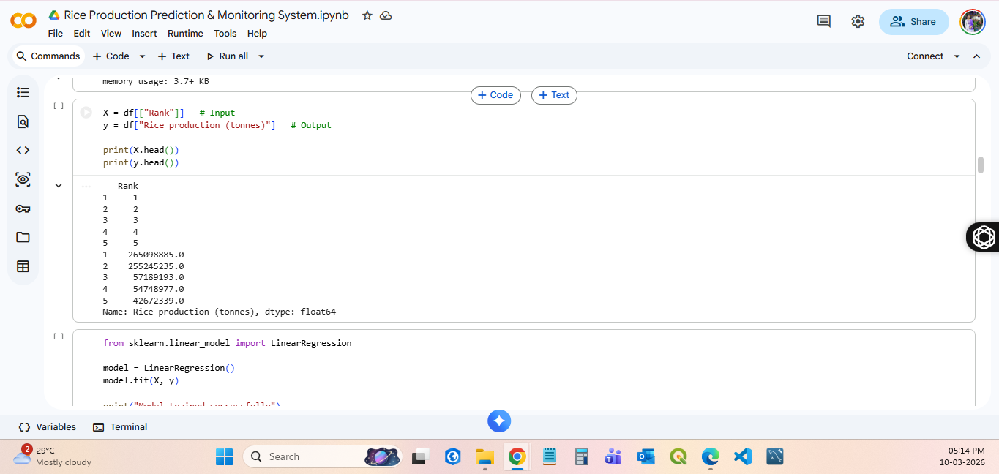

# Rice Production Prediction & Monitoring System

An end-to-end Machine Learning system for predicting rice production using web-scraped agricultural data.
The project includes data collection, preprocessing, model training, experiment tracking, API deployment, and containerized infrastructure.

## Project Overview

This project builds a complete ML pipeline that predicts rice production using historical agricultural data. The system integrates model experimentation, deployment through an API, and monitoring capabilities.

The project demonstrates a practical ML lifecycle including:

* Data collection and preprocessing
* Feature engineering
* Model training and optimization
* Experiment tracking
* API deployment
* Containerization with Docker

## Key Features

* Automated data collection from public agricultural sources
* Feature engineering and preprocessing pipeline
* Ridge Regression model for production prediction
* Hyperparameter tuning using Optuna
* Experiment tracking with MLflow
* FastAPI service for model inference
* Containerized deployment using Docker
* CI/CD pipeline using GitHub Actions

## Project Structure

Rice-Production-Prediction-Monitoring-System
│
├── data/                 # Dataset used for training
├── model/                # Saved ML models
├── notebook/             # Jupyter notebooks for development
├── screenshots/          # Project screenshots for documentation
│
├── Dockerfile            # Docker container configuration
├── docker-compose.yml    # Multi-service container setup
├── requirements.txt      # Python dependencies
├── README.md             # Project documentation

## Model Details

**Algorithm:** Ridge Regression
**Target Variable:** Rice Production
**Optimization:** Optuna Hyperparameter Tuning

The model was trained using processed agricultural production datasets to estimate rice yield based on various influencing features.

## API Deployment

The trained model is served using **FastAPI**.

Example prediction endpoint:

POST /predict

Example input JSON:

{
  "RatingsCount": 1200,
  "AverageRating": 4.2
}

Example response:

{
  "prediction": [805.22]
}

Interactive API documentation is available at:

http://localhost:8000/docs

## Docker Deployment

Docker image available on Docker Hub:

docker pull aishwarya041202/rice-production-prediction:latest

Run the container:

docker run -p 8000:8000 aishwarya041202/rice-production-prediction

After running, access the API at:

http://localhost:8000/docs

## CI/CD Pipeline

The project uses **GitHub Actions** to automate Docker builds.

Pipeline workflow:

1. Push code to GitHub
2. GitHub Actions builds Docker image
3. Image is pushed to Docker Hub
4. Deployment-ready container becomes available

## Screenshots
### Data Collection

### Feature Engineering

### Model Training

### MLflow Experiment Tracking

### FastAPI Service

### Prediction Endpoint

### Drift Monitoring

## Technologies Used

* Python
* Pandas
* Scikit-learn
* Optuna
* MLflow
* FastAPI
* Docker
* GitHub Actions
